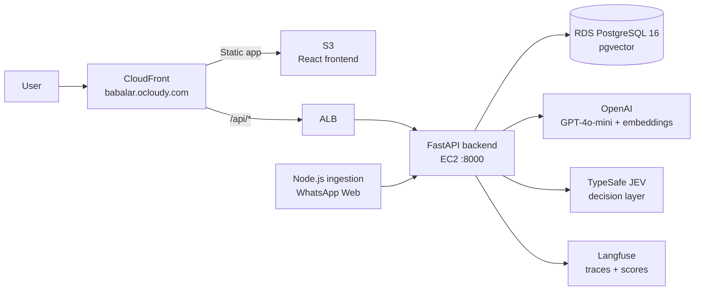
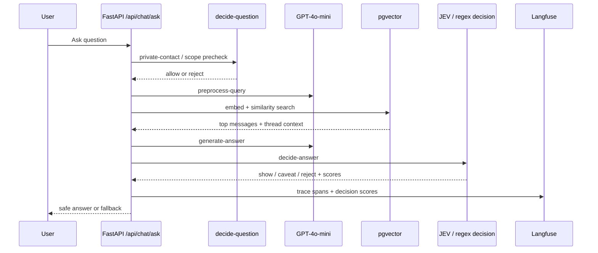

# Babalar

A RAG-based chatbot that indexes WhatsApp group conversations, stores them in a vector database, and lets users ask questions in Turkish.

## Architecture



- **Backend** — FastAPI, SQLAlchemy async, pgvector (1536-dim HNSW)
- **Frontend** — React 18, TypeScript, Vite, Tailwind CSS, Zustand
- **Ingestion** — Node.js, whatsapp-web.js, cron-based
- **LLM** — GPT-4o-mini (Q&A, preprocessing, categorization) + text-embedding-3-small
- **Decision Layer** — TypeSafe JEV for groundedness, PII, scope, and show/reject decisions
- **Infra** — AWS (EC2, RDS PostgreSQL 16, CloudFront + S3), CDK (Python)
- **Observability** — Langfuse traces and scores (`answer_grounded`, `pii_risk`, `out_of_scope`, `answer_action`)

### Live Production

| Endpoint | Status |
|----------|--------|
| https://babalar.ocloudy.com | CloudFront + S3 frontend |
| https://babalar.ocloudy.com/api/health | Backend health via CloudFront |
| Current deployed backend version | `20261004.3373b40` |

---

## RAG + Decision Flow



---

## Local Setup

### Requirements

- Docker & Docker Compose
- Node.js 20+ (optional, for frontend development outside Docker)

### 1. Config

```bash
cp .env.example .env
# Edit .env — at minimum fill in OPENAI_API_KEY, JWT_SECRET, INGEST_API_KEY
```

### 2. Start

```bash
./run.sh          # docker compose up -d
```

On first start, run migrations and admin setup:

```bash
docker compose exec backend alembic upgrade head
docker compose exec backend python -m app.cli setup \
  --email you@example.com --username admin --password yourpassword
```

### 3. Local URLs

| Service | URL |
|---------|-----|
| Frontend | http://localhost:5173 |
| Backend API | http://localhost:8000 |
| Swagger Docs | http://localhost:8000/docs |

### run.sh Commands

```bash
./run.sh              # Start (default)
./run.sh down         # Stop
./run.sh restart      # Restart
./run.sh logs         # All logs
./run.sh logs backend # Specific service log
./run.sh status       # Container status
```

---

## WhatsApp Connection

On first connect, you need to scan a WhatsApp Web QR code. Two options:

**Local:** QR code is printed to terminal via `docker compose logs ingestion`.

**AWS:** Admin panel → Groups tab → QR code appears on screen, scan with phone.

If the connection drops, the ingestion container restarts automatically and generates a new QR.

---

## Observability (Langfuse)

The RAG pipeline (`babalar-backend/app/services/rag.py`), categorizer, and embedding calls are instrumented with [Langfuse](https://langfuse.com) via the OpenAI drop-in wrapper. Tracing is optional — if no keys are set, it's a no-op.

**Enable:**

```bash
# In .env
LANGFUSE_PUBLIC_KEY=pk-lf-...
LANGFUSE_SECRET_KEY=sk-lf-...
LANGFUSE_BASE_URL=https://cloud.langfuse.com   # EU region (default); use https://us.cloud.langfuse.com for US
```

Keys are found in the Langfuse UI → **Settings → API Keys**. Restart the backend after changing `.env`.

**JEV decision layer (optional):**

```bash
TYPESAFE_API_KEY=sk-...
JEV_ENABLED=true
JEV_MODEL=jev-1.13.0
```

When configured, JEV runs after answer generation as a typed decision layer. It checks whether the answer is grounded in retrieved WhatsApp context, whether the request is out of scope, whether the answer contains PII, and whether the app should show or reject it. A lightweight regex PII guard runs even when JEV is not configured.

**What gets traced**, per query:

- `rag-answer` — root trace, tagged with `user_id` for per-user filtering
  - `decide-question` — early request decision span (for example private-contact requests)
  - `preprocess-query` — GPT-4o-mini query rewrite/typo-fix generation
  - `pgvector-search` — vector similarity search span (query, top_k, result count)
  - `generate-answer` — final GPT-4o-mini answer generation
  - `decide-answer` — JEV/PII decision span (action, risk scores, block reason)
- `categorize-batch` — one trace per ingestion categorization run (message/chunk counts, category distribution)

**Langfuse score configs:**

| Score | Type | Meaning |
|-------|------|---------|
| `answer_grounded` | numeric 0-1 | JEV confidence that answer is supported by retrieved WhatsApp context |
| `pii_risk` | numeric 0-1 | JEV/guard probability that the answer exposes personal data |
| `out_of_scope` | numeric 0-1 | JEV probability that the request is outside Babalar's scope |
| `answer_action` | categorical | `show`, `show_with_caveat`, `reject`, or `needs_review` |

View traces at your Langfuse project URL (cloud.langfuse.com or self-hosted).

---

## AWS Deploy

See **[docs/aws-deploy.md](docs/aws-deploy.md)** for the full step-by-step guide (IAM setup, config, deploy, post-deploy).

**Quick start** (assumes prerequisites are met):

```bash
cp deploy.config.example deploy.config
# Fill in deploy.config
./deploy.sh
```

**Script options:**

```bash
./deploy.sh                  # Full deploy: secrets + infra + frontend
./deploy.sh --skip-secrets   # Skip re-uploading secrets (already in Secrets Manager)
./deploy.sh --infra-only     # Infra only (VPC, EC2, RDS) — skip frontend build/deploy
./deploy.sh --frontend-only  # Frontend only (build React + upload to S3/CloudFront)
```

**Common workflows:**

```bash
# Changed only frontend code
./deploy.sh --frontend-only

# Changed backend/infra, secrets already exist
./deploy.sh --skip-secrets --infra-only

# Update backend/ingestion code on EC2 (no CDK needed — SSH/SSM into instance)
# aws ssm start-session --target <INSTANCE_ID> --region eu-central-1 --profile babalar
# sudo -i
# cd /app && git pull
# BUILD_VERSION=$(git log -1 --format="%cd.%h" --date=format:"%Y%m%d") docker compose -f docker-compose.prod.yml up -d --build
```

### AWS Infrastructure

| Resource | Type | Cost |
|----------|------|------|
| EC2 t4g.small (Graviton2) | Backend + ingestion | ~$15/mo |
| RDS t4g.micro PostgreSQL 16 | pgvector, private subnet | ~$13/mo |
| ALB | Routes CloudFront → EC2 (HTTP only, not public) | ~$18/mo |
| CloudFront + S3 | Single entry point: frontend + `/api/*` proxy, Germany geo-restriction | ~$1/mo |
| Secrets Manager | API keys, DB password | ~$2/mo |

EC2 access is via **AWS SSM Session Manager** — no SSH, no open port 22.

---

## Database Migration

```bash
# Local
docker compose exec backend alembic upgrade head

# Generate new migration
docker compose exec backend alembic revision --autogenerate -m "description"
```

---

## Project Structure

```
babalar/
├── babalar-backend/        # FastAPI application
│   ├── app/
│   │   ├── api/            # Route handlers (auth, chat, admin, ingest)
│   │   ├── services/       # Business logic (rag, embedding, categorizer, rate_limiter)
│   │   └── models/         # SQLAlchemy ORM models
│   └── alembic/            # DB migrations
├── babalar-frontend/       # React application
│   └── src/
│       ├── pages/          # ChatPage, AdminPage, LoginPage, RegisterPage
│       ├── store/          # Zustand store (auth, theme)
│       └── api/            # Axios client
├── babalar-ingestion/      # WhatsApp data collection service
│   └── src/
│       ├── index.js        # Entry point, cron + trigger polling
│       ├── scheduler.js    # Per-group data fetch logic
│       ├── whatsapp.js     # whatsapp-web.js connection, QR management
│       └── api-client.js   # Sends messages/status to backend
├── infrastructure/         # AWS CDK (Python)
│   ├── stacks/
│   │   ├── network_stack.py   # VPC, Security Groups (ALB SG restricted to CloudFront IPs)
│   │   ├── database_stack.py  # RDS PostgreSQL 16 (private subnet)
│   │   ├── compute_stack.py   # EC2 ASG, ALB (HTTP-only, internal)
│   │   └── frontend_stack.py  # S3 + CloudFront (/api/* → ALB, default → S3)
│   ├── app.py                 # CDK entry point (infra stacks)
│   └── app_frontend.py        # CDK entry point (frontend stack, separate to avoid dist/ at synth)
├── deploy.config.example   # Deploy config template
├── deploy.sh               # AWS deploy script
├── docker-compose.yml      # Local development
├── docker-compose.prod.yml # Production (no postgres or frontend)
└── run.sh                  # Local startup helper
```
