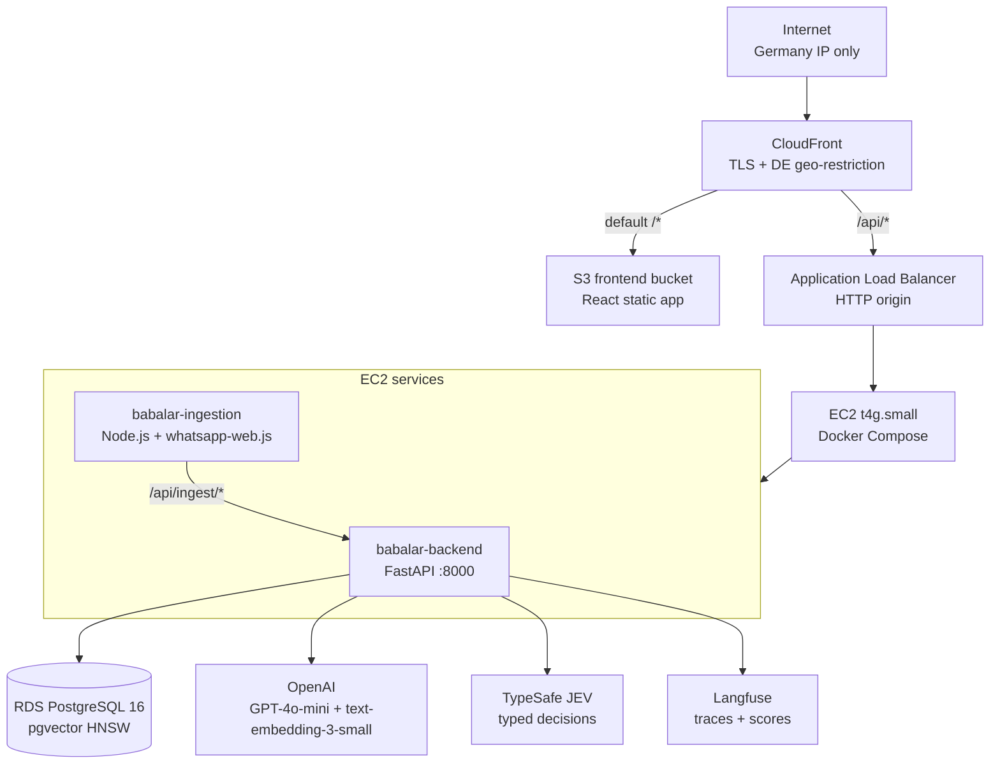
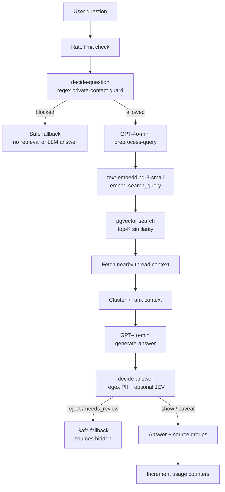
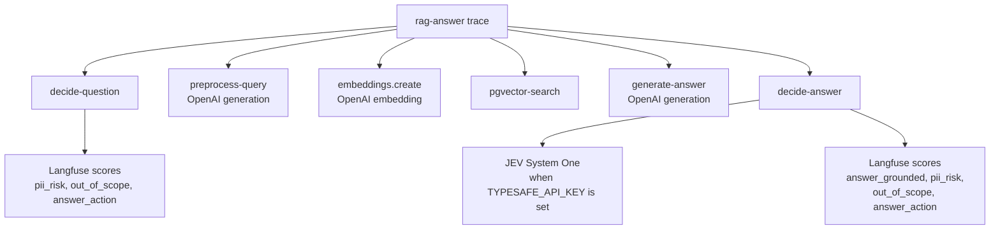
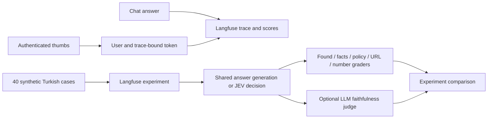
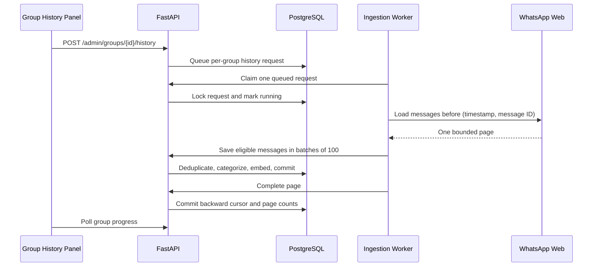

# Babalar — Architecture

## Overview

**Babalar** is a chatbot that indexes WhatsApp group conversations and answers questions via RAG (Retrieval-Augmented Generation). Messages are pulled nightly, stored in a vector database, answered using GPT-4o-mini, and checked by a typed JEV decision layer before responses are shown.

**Domain**: `babalar.ocloudy.com`  
**Access**: Germany only (CloudFront geo-restriction)

---

## System Architecture



**Traffic flow:**
- `GET /` → CloudFront → S3 (React static files, cached)
- `POST /api/chat/ask` → CloudFront → ALB → EC2 (not cached, all headers forwarded)
- ALB has no public HTTPS — CloudFront terminates SSL, ALB runs HTTP only
- ALB security group only allows traffic from the CloudFront managed prefix list

**Current production endpoint:** `https://babalar.ocloudy.com/api/health` returns `{"status":"ok","version":"20261004.3373b40"}`.

---

## Components

### babalar-backend (Python 3.12 + FastAPI)
- REST API: auth, chat, admin, ingest
- RAG pipeline: question guard → query preprocessing → embedding → pgvector similarity search → GPT-4o-mini answer → decision guard
- JEV decision layer: optional TypeSafe System One check for grounding, out-of-scope, PII risk, and show/reject decisions
- Regex PII fallback: blocks obvious private contact requests and private contact details even when JEV is not configured
- Langfuse observability: OpenAI wrapper plus explicit spans for retrieval and decision steps
- JWT-based auth + invite code registration
- Rate limiting (PostgreSQL-backed, per-user + global daily limits)
- Port: 8000

### babalar-ingestion (Node.js)
- Connects to WhatsApp Web via whatsapp-web.js (read-only)
- Runs nightly at 02:00 UTC via node-cron
- Tracks `last_ingested_at` per group, fetches only new messages
- POSTs to backend `/api/ingest/messages` in batches of 100

### babalar-frontend (React + Vite + TypeScript + Tailwind)
- Login / Registration (invite code required)
- Chat interface (question → RAG answer + source messages)
- Category-based browse
- Admin panel (rate limits, invite codes, groups)
- Hosted on S3, served via CloudFront

### infrastructure (AWS CDK, Python)
- `NetworkStack`: VPC, subnets, security groups
- `DatabaseStack`: RDS PostgreSQL 16, private subnet
- `ComputeStack`: EC2, ASG, ALB, IAM role
- `FrontendStack`: S3, CloudFront (frontend + API proxy)

---

## AWS Infrastructure

### CloudFront
- **Default behavior** (`/*`): S3 origin — serves React frontend, caching enabled
- **API behavior** (`/api/*`): ALB origin — proxies to backend, caching disabled, all headers forwarded
- SSL: ACM certificate (us-east-1, required by CloudFront)
- Geo-restriction: DE only
- Price Class 100 (US + EU edges)

### ALB (Application Load Balancer)
- HTTP only (port 80) — CloudFront handles HTTPS
- Security group ingress: CloudFront managed prefix list only (not public)
- Target: EC2 port 8000
- Health check: `GET /health`

### EC2
- Instance: `t4g.small` (ARM Graviton2, 2 vCPU, 2 GB RAM)
- AMI: Amazon Linux 2023 ARM64
- Security group: port 8000 from ALB only — no SSH (use SSM Session Manager)
- IAM role: Secrets Manager read, CloudWatch Logs, SSM
- EBS: 20 GB gp3

### RDS
- Instance: `db.t4g.micro` (1 GB RAM)
- PostgreSQL 16 + pgvector extension
- Private subnet — no public access
- Security group: port 5432 from EC2 only
- Backup: 7-day retention, deletion protection enabled

### Secrets Manager
| Secret | Content |
|--------|---------|
| `babalar/db-password` | `{"password": "..."}` |
| `babalar/openai-api-key` | OpenAI API key |
| `babalar/jwt-secret` | JWT signing secret |
| `babalar/ingest-api-key` | Internal ingestion key |
| `babalar/langfuse-public-key` | Optional Langfuse public key |
| `babalar/langfuse-secret-key` | Optional Langfuse secret key |
| `babalar/langfuse-base-url` | Optional Langfuse host, defaults to EU cloud |
| `babalar/typesafe-api-key` | Optional TypeSafe API key for JEV |
| `babalar/jev-model` | Optional JEV model override, defaults to `jev-1.13.0` |

---

## Cost Estimate (eu-central-1, monthly)

| Resource | Notes | Estimate |
|----------|-------|---------|
| EC2 t4g.small | On-demand | ~$15 |
| RDS db.t4g.micro | Single-AZ | ~$13 |
| ALB | ~$18 |
| CloudFront | Price Class 100 | ~$1-3 |
| S3 | Static hosting | <$1 |
| Secrets Manager | 4 required + optional observability/JEV secrets | ~$2-4 |
| CloudWatch Logs | | ~$1 |
| GPT-4o-mini | 5000 Q/day max | ~$10-20 |
| OpenAI Embeddings | text-embedding-3-small | ~$2 |
| TypeSafe JEV | Optional decision calls | Depends on usage/plan |
| **Total** | | **~$65-75/mo** |

---

## Database Schema

```sql
CREATE TABLE users (
    id            UUID PRIMARY KEY DEFAULT gen_random_uuid(),
    email         VARCHAR(255) UNIQUE NOT NULL,
    username      VARCHAR(100) UNIQUE NOT NULL,
    password_hash VARCHAR(255) NOT NULL,
    invite_code   VARCHAR(50),
    is_admin      BOOLEAN DEFAULT FALSE,
    is_active     BOOLEAN DEFAULT TRUE,
    created_at    TIMESTAMPTZ DEFAULT NOW()
);

CREATE TABLE invite_codes (
    id         UUID PRIMARY KEY DEFAULT gen_random_uuid(),
    code       VARCHAR(50) UNIQUE NOT NULL,
    max_uses   INTEGER DEFAULT 10,
    use_count  INTEGER DEFAULT 0,
    is_active  BOOLEAN DEFAULT TRUE,
    created_at TIMESTAMPTZ DEFAULT NOW()
);

CREATE TABLE wa_groups (
    id               UUID PRIMARY KEY DEFAULT gen_random_uuid(),
    wa_group_id      VARCHAR(255) UNIQUE NOT NULL,
    group_name       VARCHAR(255) NOT NULL,
    is_active        BOOLEAN DEFAULT TRUE,
    last_ingested_at TIMESTAMPTZ,
    created_at       TIMESTAMPTZ DEFAULT NOW()
);

CREATE TABLE messages (
    id          UUID PRIMARY KEY DEFAULT gen_random_uuid(),
    group_id    UUID REFERENCES wa_groups(id) ON DELETE CASCADE,
    sender_name VARCHAR(255),
    content     TEXT NOT NULL,
    sent_at     TIMESTAMPTZ NOT NULL,
    ingested_at TIMESTAMPTZ DEFAULT NOW(),
    category    VARCHAR(100),
    embedding   vector(1536),
    CONSTRAINT content_not_empty CHECK (length(trim(content)) > 0)
);
CREATE INDEX ON messages USING hnsw (embedding vector_cosine_ops);
CREATE INDEX ON messages (category);
CREATE INDEX ON messages (sent_at DESC);

CREATE TABLE user_daily_usage (
    user_id    UUID REFERENCES users(id) ON DELETE CASCADE,
    usage_date DATE NOT NULL DEFAULT CURRENT_DATE,
    count      INTEGER DEFAULT 0,
    PRIMARY KEY (user_id, usage_date)
);

CREATE TABLE daily_total_usage (
    usage_date DATE PRIMARY KEY DEFAULT CURRENT_DATE,
    count      INTEGER DEFAULT 0
);

CREATE TABLE admin_config (
    key        VARCHAR(100) PRIMARY KEY,
    value      TEXT NOT NULL,
    updated_at TIMESTAMPTZ DEFAULT NOW()
);
-- Defaults: user_daily_limit=5, total_daily_limit=5000, rag_top_k=10, ingestion_lookback_days=30
```

---

## RAG Pipeline



Detailed order:

1. Rate limit check.
2. `decide-question` blocks obvious private-contact requests early.
3. GPT-4o-mini corrects Turkish text and resolves follow-up questions into `search_query`.
4. `text-embedding-3-small` embeds the `search_query`.
5. pgvector returns top-K similar messages.
6. Nearby messages are fetched to reconstruct short WhatsApp threads.
7. GPT-4o-mini generates a grounded Turkish answer from retrieved context.
8. `decide-answer` runs regex PII checks and optional JEV checks.
9. The backend returns a safe answer, or a safe fallback if blocked.
10. Usage counters are incremented by the API layer.

### Decision Layer

The decision layer lives in `babalar-backend/app/services/decision.py`.

It has two checkpoints:

1. `decide-question` runs before embeddings/retrieval. It blocks obvious private-contact requests such as asking for a named person's phone number, email, or address.
2. `decide-answer` runs after GPT-4o-mini generates an answer. It blocks obvious PII via regex and, when TypeSafe is configured, asks JEV typed questions:
   - `answer_action`: `show`, `show_with_caveat`, `reject`, or `needs_review`
   - `answer_grounded`: probability that the answer is supported by retrieved context
   - `out_of_scope`: probability that the request is outside the Babalar archive scope
   - `pii_risk`: probability that the answer exposes personal data

Configured thresholds:

| Env var | Default | Effect |
|---------|---------|--------|
| `JEV_PII_BLOCK_THRESHOLD` | `0.70` | Block if JEV sees high PII risk |
| `JEV_OUT_OF_SCOPE_BLOCK_THRESHOLD` | `0.80` | Block if request is likely out of scope |
| `JEV_GROUNDING_BLOCK_THRESHOLD` | `0.35` | Block if a found answer is poorly grounded |

If TypeSafe/JEV is not configured, the service keeps working with `decision_source=disabled`; regex PII protections still run.

### Observability

Langfuse is optional. If `LANGFUSE_PUBLIC_KEY` and `LANGFUSE_SECRET_KEY` are set, the backend emits traces like:



Trace output includes safe metadata such as `found`, `source_count`, `decision`, `decision_source`, risk scores, and context/answer lengths. Raw API keys and auth tokens are not traced.

Configured Langfuse score schemas:

| Score | Type | Range/Categories |
|-------|------|------------------|
| `answer_grounded` | numeric | `0` to `1` |
| `pii_risk` | numeric | `0` to `1` |
| `out_of_scope` | numeric | `0` to `1` |
| `answer_action` | categorical | `show`, `show_with_caveat`, `reject`, `needs_review` |

---

## Ingestion Pipeline

### Langfuse Evaluation Workflow

Live RAG records trace-level `found`, `source_count`, `retrieval_count`,
`top_similarity`, `answer_blocked`, and `decision_source`. Literal URL/number
support checks score the candidate answer before the decision gate. JEV scores
remain attached to `decide-answer`, now an evaluator observation, with a nested
`jev-decision` generation reporting the actual model and token counts.



The dataset is a workshop fixture suite, not an archive retrieval benchmark.
Separately labelled `kind=archive` items run the complete live RAG path. SDK
export-stage masking redacts contact patterns, structured sender fields, and
sender context labels from both SDK and external OTel spans. No Langfuse secret
reaches the browser; feedback proofs expire after seven days and re-ratings reuse
one score ID. See [Langfuse Workshop](langfuse-workshop.md) for runnable commands,
score definitions, and masking limitations.

```
Nightly 02:00 UTC (node-cron)
    → Connect to WhatsApp Web (persisted session)
    → For each active group:
        - Fetch messages since last_ingested_at (first run: 30 days)
        - POST to /api/ingest/messages in batches of 100
    → Backend per message:
        1. GPT-4o-mini → assign category
        2. text-embedding-3-small → generate embedding
        3. Save to PostgreSQL
    → Update wa_groups.last_ingested_at
```

### Group History Pagination

The group table opens a history side panel with a 250/500/1,000-message page selector,
queue status, scanned/saved counts, and the next backward boundary. Each request
fetches one page; it does not activate a passive group or change `last_ingested_at`.



Progress is stored in internal `admin_config` rows keyed by `group_history:{group_uuid}`.
The queue uses row locks and request IDs to reject duplicate jobs and stale results.
Equal timestamps are disambiguated by message ID; short/non-text messages still advance
the scan cursor. A failure leaves the cursor unchanged, so partial inserts can be
retried through the existing deduplication path. Startup recovery marks interrupted
running requests as retryable errors. Manual history and filtered requests take
priority over automatic initial scans; a running scan finishes before the next job.

Each page bounds older-history loading to 40 calls and 90 seconds between calls,
with a 120-second fetch timeout. These bounds do not indicate exhaustion. Only an
empty older-history response, with no remaining page candidates, marks the history
as exhausted. Further synchronization can be checked explicitly from the panel.

---

## API Reference

### Auth
| Method | Path | Description |
|--------|------|-------------|
| POST | `/api/auth/register` | Register with invite code |
| POST | `/api/auth/login` | Login → access + refresh token |
| POST | `/api/auth/refresh` | Refresh access token |
| POST | `/api/auth/logout` | Revoke refresh token |

### Chat
| Method | Path | Description |
|--------|------|-------------|
| POST | `/api/chat/ask` | Ask a question |
| GET | `/api/chat/history` | Question history |
| GET | `/api/chat/categories` | Available categories |

### Admin
| Method | Path | Description |
|--------|------|-------------|
| GET/PUT | `/api/admin/config/{key}` | Read/update config |
| GET/POST/DELETE | `/api/admin/invite-codes` | Manage invite codes |
| GET | `/api/admin/users` | List users |
| GET | `/api/admin/stats` | Usage stats |
| GET | `/api/admin/groups` | WhatsApp groups |
| POST | `/api/admin/groups/{id}/history` | Queue one older page; optional exhausted-history recheck |
| POST | `/api/admin/groups/{id}/history/cancel` | Remove a queued page or stop the running history scan |

### Ingest (internal)
| Method | Path | Description |
|--------|------|-------------|
| POST | `/api/ingest/messages` | Batch insert messages |
| GET/POST | `/api/ingest/groups` | Group registry |
| POST | `/api/ingest/history/claim` | Claim one queued older page |
| POST | `/api/ingest/history/complete` | Commit a successful backward cursor or retryable error |
| POST | `/api/ingest/history/recover` | Recover interrupted history jobs on worker startup |

---

## Message Categories

| Category | Description |
|----------|-------------|
| `araba` | Vehicles: buying/selling, TÜV, insurance |
| `saglik` | Health: doctors, hospitals, insurance |
| `resmi-daire` | Government: Ausländerbehörde, Finanzamt |
| `cocuk` | Children: school, daycare |
| `ikinci-el` | Second-hand marketplace |
| `konut` | Housing: rent, apartment search |
| `yemek-restoran` | Food, restaurants |
| `is-kariyer` | Jobs, career |
| `egitim` | Education, courses |
| `spor-eglence` | Sports, leisure, events |
| `genel` | General / uncategorized |

---

## WhatsApp Session

The whatsapp-web.js session is persisted in `./ingestion-session` (Docker volume). Once initialized, no re-scanning is needed unless the session expires.

**Reset session:**
```bash
docker compose stop ingestion
rm -rf ./ingestion-session
docker compose up ingestion
docker compose logs -f ingestion  # scan the QR code
```
